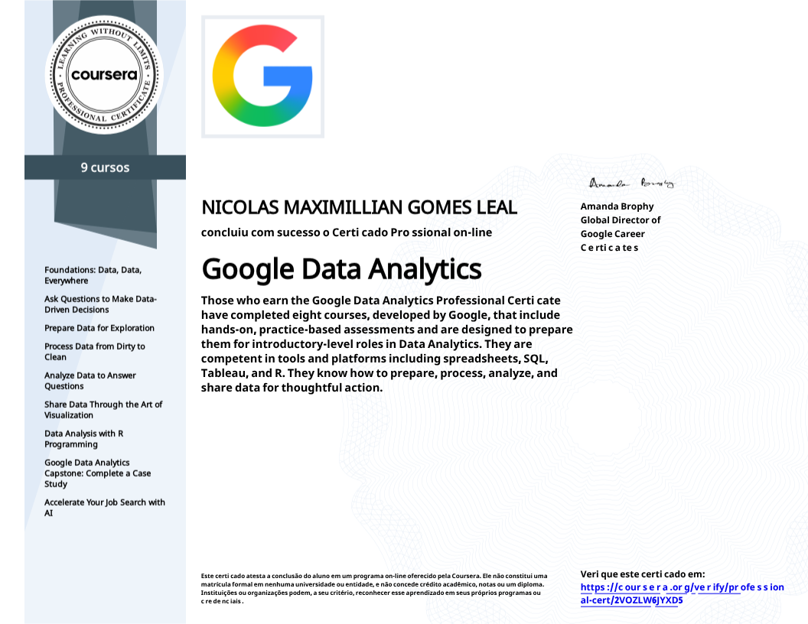

# 👋 Olá, eu sou Nicolas!

### 📊 Data Analytics | Data Science | Data Engineering

Sou formado em **Ciências Contábeis** e atualmente estou me especializando
em **Data Science & Analytics**.

Minha trajetória profissional combina **negócios, finanças e tecnologia**,
e atualmente estou direcionando minha carreira para a área de dados.

Tenho interesse em transformar dados em informações relevantes para apoiar
decisões, solucionar problemas e gerar valor para o negócio.

---

## 🚀 Sobre mim

- 🎓 Bacharel em Ciências Contábeis
- 📚 MBA em Data Science & Analytics
- 📊 Experiência com Controladoria e Planejamento Financeiro
- 🐍 Desenvolvimento e análise de dados com Python
- 🗄️ Consultas e manipulação de dados com SQL
- 📈 Interesse em Data Analytics, Data Science e Data Engineering
- ☁️ Estudos em Cloud Computing
- 🤖 Interesse em Machine Learning
- 📚 Sempre buscando aprender e desenvolver novas habilidades

---

## 🛠️ Tecnologias

---

## 📊 Ferramentas & Conhecimentos

**Data & Analytics**

- Python
- Pandas
- NumPy
- Matplotlib
- SQL
- SQLite
- Análise Exploratória de Dados
- Data Visualization
- Machine Learning

**Ferramentas**

- VS Code
- DBeaver
- Git
- GitHub
- Google Cloud

**Negócios**

- Controladoria
- Planejamento Financeiro
- Análise Financeira
- Indicadores de Desempenho
- Tomada de decisão baseada em dados

---

## 🏆 Certificações

<table>
  <tr>
    <td align="center" width="200">

      

        

      <b>Análise de Dados do Google Cloud</b>

        

      Especialização — Coursera

        

      

    </td>
  </tr>
</table>

---

## 📂 Projetos em destaque

### 📈 Análise de Ações — Itaú

Projeto desenvolvido para análise da ação **ITUB4**, utilizando técnicas de
análise de dados, indicadores financeiros e Machine Learning.

**Principais tecnologias:**

`Python` `Pandas` `NumPy` `Matplotlib` `Machine Learning`

**Principais análises realizadas:**

- 📊 Análise histórica da ação
- 📈 Médias móveis
- 📉 Bandas de Bollinger
- 📊 RSI
- 📈 MACD
- 📉 Volatilidade
- ⚠️ Value at Risk (VaR)
- 📊 Drawdown
- 🤖 Modelos de Machine Learning
- 📈 Análise de retorno e risco

🔗 **[Ver projeto no GitHub](SEU_LINK_DO_REPOSITORIO)**

---

## 🎯 Atualmente

Estou buscando uma oportunidade na área de **Dados**, especialmente em posições
de:

- 📊 Data Analytics
- 🧠 Data Science
- 🏗️ Data Engineering

Meu objetivo é unir minha experiência em **negócios e finanças** com minhas
habilidades técnicas em **dados e tecnologia**.

---

## 📫 Vamos nos conectar?

---

  <i>"Transformando dados em informações que geram valor."</i>

